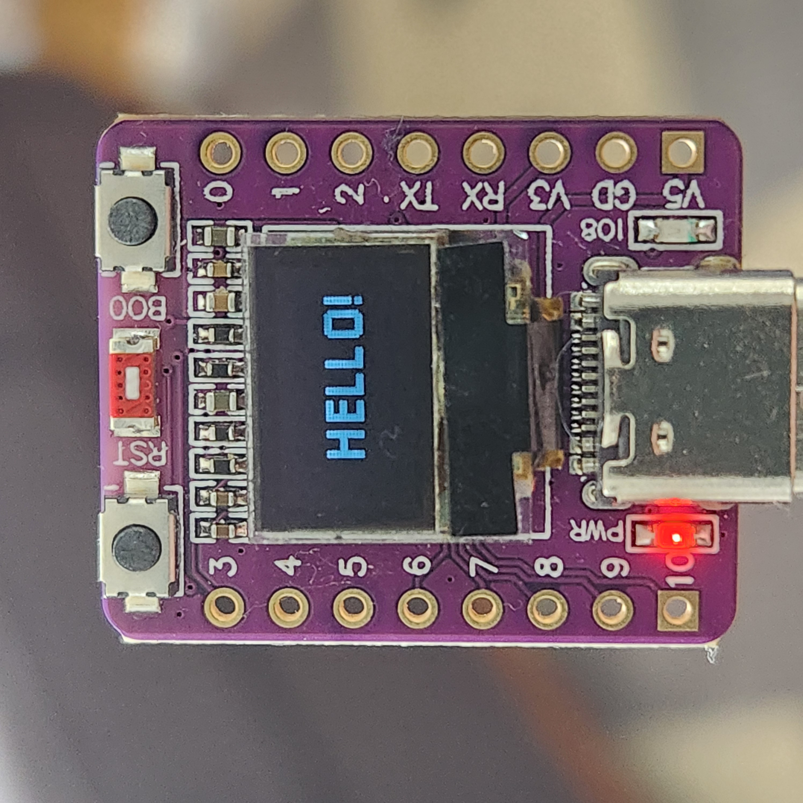

# Hello World on ESP32-C3 with 0.42 Inch OLED

This is an ESP-IDF and LVGL "Hello!" project for the, very inexpensive, ESP32-C3 with 0.42 Inch (monochrome) OLED board. LVGL code has been generated via EEZ Studio. This project is intended to be used as a basis for more functionaly applications which want to make use of the OLED display found on the board.

## Baord Details

There is only sparse information on this board but here is what I have found:
1. It includes a standard ESP32-C3 (ESP32C3FN4/FH4) with 4M Flash
2. Often available on Aliexpress for around $1
3. Has a 72x40 pixel monochrome OLED display
4. Display uses a SH1106 driver (only supports page addressing mode, unlike the SS1306 that some docs say this board has)

## Implementation

### Custom Rendering
We make use of the existing SSD1306 library which is part of the ESP-IDF, however, we make use of a custom function to draw the bitmap to the OLED. This is because [LVGL expects the following](https://docs.lvgl.io/9.2/porting/display.html#monochrome-displays)

              MSB           LSB
    bits       7 6 5 4 3 2 1 0
    pixels     0 1 2 3 4 5 6 7
              Left         Right

The SH1106, however, expects 1 byte to fill 8 vertical pixels of a column, the next byte for the 8 vertical pixels of the next column, and so on. Also since we must make use of page address mode we must take care of incrementing the PAGE number (0xB0 - 0xB7). In order to ensure that custom_panel_ssd1306_draw_bitmap() is called with a multiple of 8 vertical pixels, we must be careful in our selection of LVGL_BUF_LEN, ie. our horizontal resolution plus 8 bits for the palette.

From the LVGL documentation:
> When setting up the buffers for rendering (lv_display_set_buffers()), make the buffer 8 bytes larger. This is necessary because LVGL reserves 2 x 4 bytes in the buffer, as these are assumed to be used as a palette.

### Font
We make use of a 1-bit font called Pixellari as the built-in MONTSERRAT fonts are 4-bit (I believe) and thus will not render properly. Many thanks to [Zacchary Dempsey-Plante](https://ztdp.ca/) for creating this great font and making it available. It can be found [here](https://ztdp.ca/).

### EEZ Studio
The majority of the LVGL projects out there make use of SquareLine Studio but here I have decided to make use of [EEZ Studio](https://github.com/eez-open/studio). Use whatever method you find easiest to get it up and running. Be sure to use only black (#000000) and white (#ffffff) elements on your screens.

Copy the generated code from the projects into `components/ui` being sure to leave the `CMakeLists.txt` file in place. You will need to adjust the include to change `lvgl/lvgl.h` to `lvgl.h`, however, this should be the only change required.

## References
Many thanks to the following projects and sites for helping to understand this board and get it running
1. [https://github.com/zhuhai-esp/ESP32-C3-ABrobot-OLED](https://github.com/zhuhai-esp/ESP32-C3-ABrobot-OLED)
2. The Arduino code provided by as an answer [here](https://electronics.stackexchange.com/questions/725871/how-to-use-onboard-0-42-inch-oled-for-esp32-c3-oled-development-board-with-micro)
3. Discussions [here](https://forum.arduino.cc/t/whats-the-difference-between-adafruit-ssd1306-and-sh1106/247368/12)
